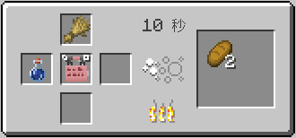
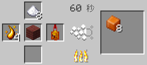
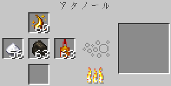
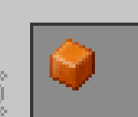

センパーイ！あーしもアタノール使ってんだけどさ！
お、やってるのだ。何作ってるのだ？
パン！ちゃんとパンになったよ！

パンは基本なのだ。
……ん？ねえセンパイ、なんか甘い匂いしない？
ああ、ボクの方なのだ。ちょっと別のものを作ってるのだ。

すっごいキャラメルみたいな匂い！何それ！？
砂糖と樹液を煮詰めたものにヴェロペダ酒を混ぜてるのだ。
お砂糖……メープルシロップ……？
それジャムでしょ！！
え？
だってお砂糖とメープルシロップ煮詰めたら、もうジャムじゃん！！お酒入ってんのもオシャレだし！！
いや、これはジャムとは違うのだ。これは――
あーしも作りたい！教えて！
……あの。
お砂糖はあるし、その樹液ちょっと分けてもらっていい？
いいけど、ちょっと待ってほしいのだ。これは――
ありがと！ヴェロペダのやつもこっちにあるから……
よし、全部入れた！
……



……あとは炉に全部任せればいいんだよね？
……そうなのだ。
パンに塗ったら最高だろうな～！
…………



あっ、できた！すっごいキャラメル色！

匂いもやばい。絶対おいしいやつだよ、これ！
焼きたてのパンに乗っけてー……いっただっきまーす♪
…………
……ぶっ！
まっっっず！！何これ！！かっら！！
固形燃料なのだ。
は！？
炉に使う固形燃料なのだ。カラメルみたいな匂いはするけど、人間が食べるものではないのだ。
先に言ってよ……
3回言おうとしたのだ……
