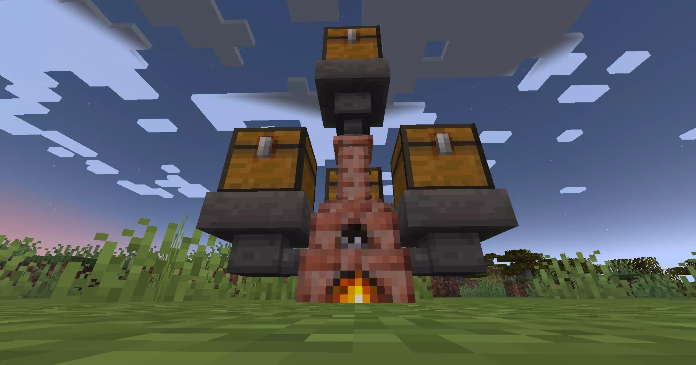
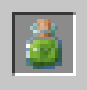
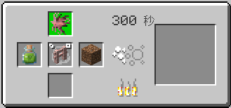
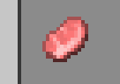

やっほ～！センパーイ、何してんの？
お、来たのだ。ちょうどいいタイミングなのだ。

えっ、何これ！？めっちゃデカっ！
これがアタノールなのだ。素材をゆっくり時間をかけて加工できる機械なのだ。
へーー！今日は何作るの？
今からやるのだ。

何その瓶？
生命の水なのだ。
生命の水！？なんか、すごそうな名前じゃん！飲めるの？
飲めなくもないのだが、今日は土に注ぐのだ。

妖精の力と合わせると、物質の性質を変えられるのだ。
土が！？
そうなのだ。生命の水と、妖精と、土と。全部入れるのだ。
え！？じゃあここから何か出てくるの！？
金とか！？ダイヤとか！？
……場合によってはなのだ。
やばい！絶対見てる！



……なんか、土がちょっと赤っぽくなってきたっぽい……？
なってるのだ。
……もうそろそろ？
もうそろそろいいかもなのだ。
え！？できた！？金出た！？

……えっ！？
ちょっ、何これ！？
肉！？肉じゃんこれ！？
豚肉なのだ。
土じゃなかったの！？あーし、ずっと見てたのに！！
いつの間に肉になったの！？
産まれたいものに、材料ときっかけが注がれるのだ。
この機械は産まれたいものたちのための機械なのだ。
何それ！？全然金とかダイヤじゃないじゃん！！
