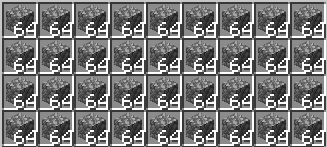
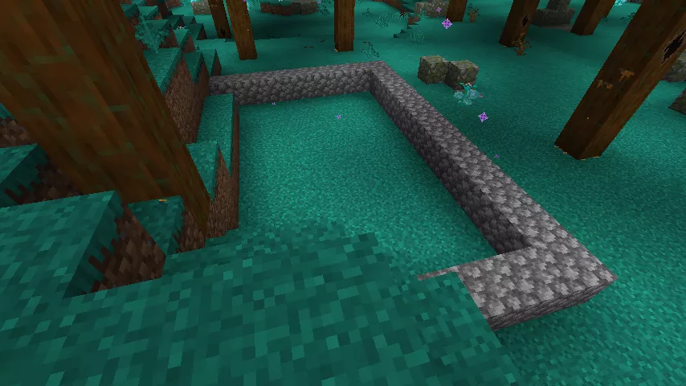
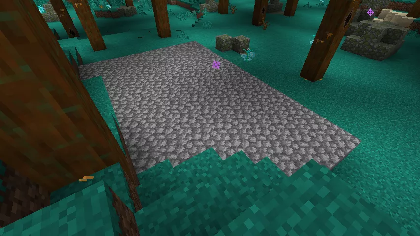
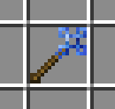
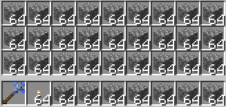
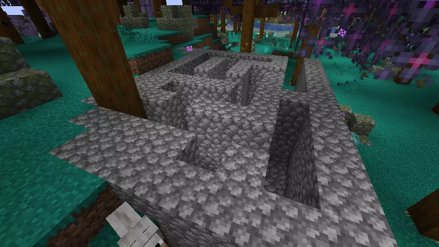
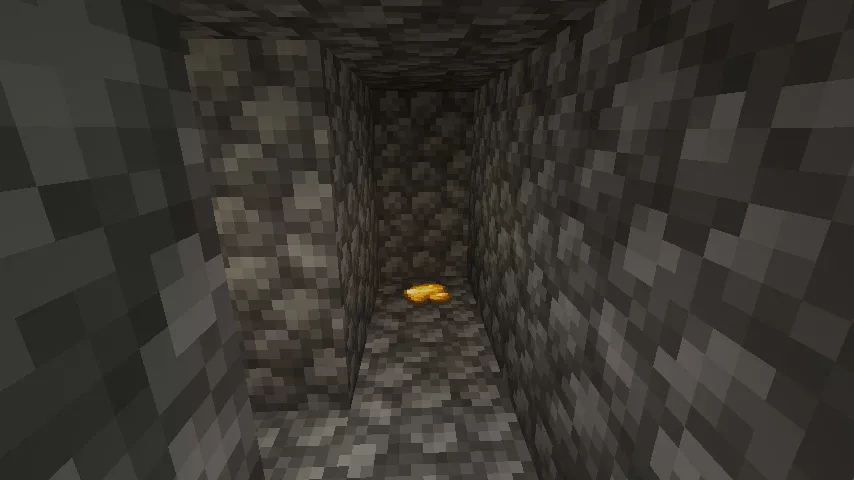

よし、ここはこの辺まで……あっち側は……
セ～ンパイ！おっはよ！何してるの？
おはようなのだ。新しい作業場の基礎を作っているのだ。
あーしも手伝うよ！これだよね、どこに積めばいい？

そこを囲むように並べてほしいのだ。
あいよー！
ゴッゴッゴッゴッ――（石を設置する音）



よっしゃ！次はここを埋めればいいんだよねっ――
あとはこうなのだ。
ゴゴゴッ（石が設置される音）

えっ！？何今の！？

ビルダーズロッドなのだ。平らなところに使うと隙間なく埋めてくれるのだ。
超便利じゃん！！あーしもやりたい！！
気を付けて使うのだ。床とかにぶつけると大変なのだ。
わーってるって！！ここの丸石、全部持ってっていいよね！？
う、うん。（ほんとに大丈夫かなのだ……

装填完了！！次はどこ埋めればいいのかなっ？？？
じゃあ今作った基礎の上に3段、頼むのだ。



――できた！迷路！！

……えっ。基礎作りはどうなったのだ？
ちょっとだけだって、どうせすぐ埋めちゃうから！
基礎が先にできないと床も作れないのだ。
大丈夫、あとで上塞ぐって！
……まあ、つむぎが楽しければいいかなのだ。



よっしゃ！トレジャーゲット！！！

――あー面白かった！
……そろそろ手伝いに行こっと。
……あれ？どっちから来たっけ……？



こっちも……行き止まりじゃん……？？？
……あれ？あーしつるはし持って来てなかったっけ……？あれあれ？？
……
センパーイ！！出られないんだけど！！
どうしたのだ？
どうやって一気に壊すのこれ！？
ビルダーズロッドに壊す機能はないのだ。
えーっ！！先に言ってよーっ！
