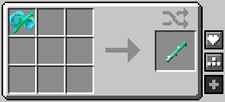
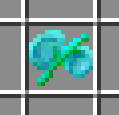
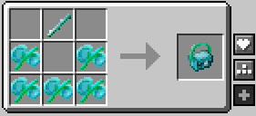
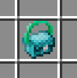
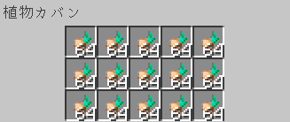

センパーイ、何してんのっ？（ぽんっ
わわっ！危ないのだ！
今ミラージュでカバンを編んでいるところなのだ。
えっ！カバン！？あーしも手伝う！



これを茎だけにすればいいんだよね！
ちょっと待つのだ、それは——
～♪えいっ！！……あっ
いったーーーい！！！
大丈夫かなのだ。
……血は出てないみたい……

これはミラージュの葉なのだ。気を付けて触らないと怪我するのだ。
むぇー……
！？――ていうか、そんなのでカバンなんか作って大丈夫なの！？
ちゃんと向きを揃えて編めば大丈夫なのだ。
そんなもんなんだ……？
……確かに、カバンは大丈夫みたい……
初級レベルなのだ。



だんだん形になってきた……かも！
不揃いだけど、カバンとしては十分なのだ。
あーし、他に何か手伝えること、ある？
持ち手の部分に茎を通してほしいのだ。

こう……？あ、なるほどね。こうなってるんだ。
完成なのだ。

わっ、ちゃんとカバンだ！



ねえ、これ何入れるの？
ミラージュの球根なのだ。

……また指切るじゃん。
気を付けねばなのだ。
