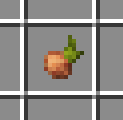
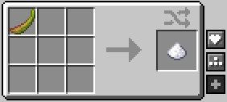
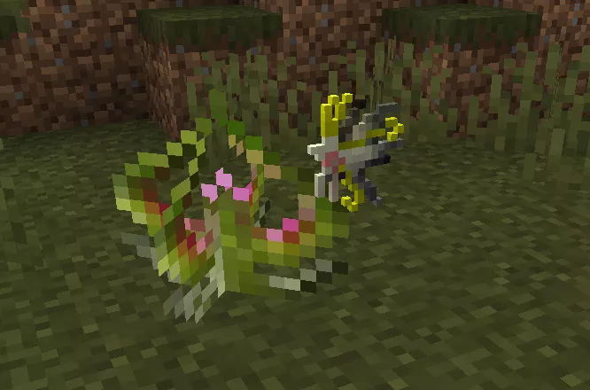
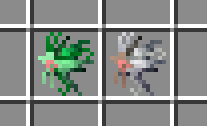
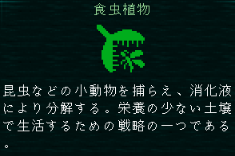

つむぎ、何をしているのだ？
水やり～。センパイ、これ見てよ。なんかすごい形してない？
すごいのだ。
よく分かんないけど、なんか面白いから育ててみることにしたの。

妖花目ヴェロペダ科、瓶子草サラセニアなのだ。
センパイ知ってるの、この草？
沼地に生息する食虫植物の一種なのだ。
葉っぱから砂糖を抽出したり、錬金術の材料に使われたりするのだ。

へ～。それでこんなに甘酸っぱい香りなんだ。センパイ物知りだな～
ジャムにしても多分おいしいのだ。
ジャム！！美味しそう！！絶対いつか作るっ！



あっ、来た来た！！
……何なのだ？
通りすがりの子がよくここで休みに来るんだよね。
昨日は緑の子が来てさ、おとといは白くて丸い子で。やっぱ妖精も甘いのが好きなのかな。

今日の子はちょっと大きめかな、羽がふわっとしてる。
……かわいいのだ。
でしょー！！あーしのサラセニアめっちゃ大人気じゃん！！



……
ねえつむぎ。
同じ子がまた来たことはあるのだ？
えー……？毎回違う感じはするかなぁ。でもいっぱい来るし、覚えてないだけかも。
来た子は、どこへ帰っていくのだ？
どこへ……？
……そういえば帰るの、見たことないかも……

……えっ……じゃあこの葉っぱの中って……
……のだ。
あの子たち、みんなあーしのサラセニアに食べられちゃったの！？
自然の摂理なのだ。
そんなのってないよー！！
