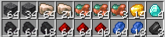
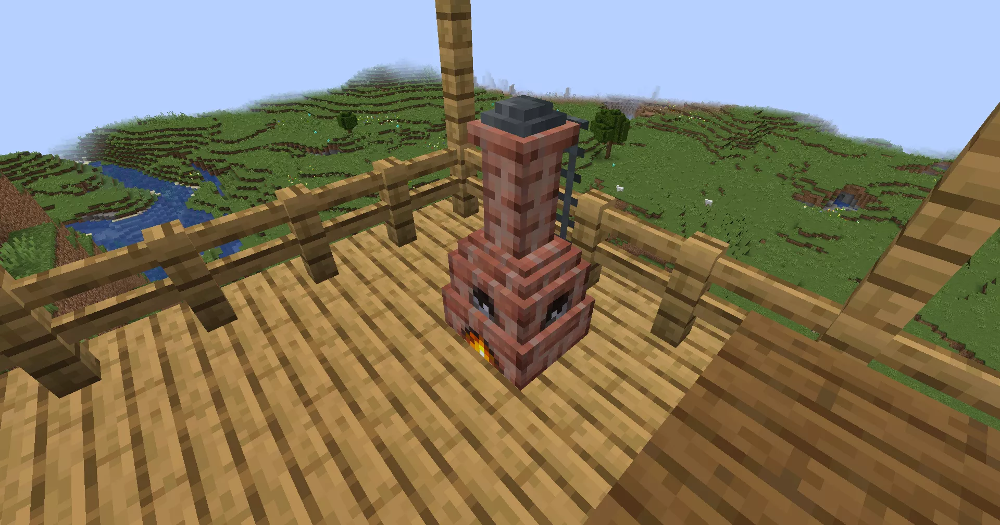
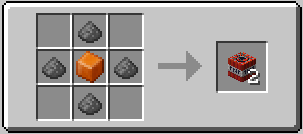
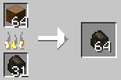
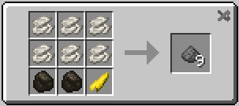
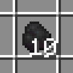
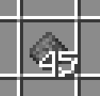
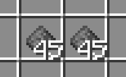
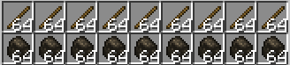

はー……疲れたー……
おかえりなのだ。今日は長かったのだ？
でかい洞窟見つけちゃって……

ほら、全部掘ってきた。
豊作なのだ。
もう腕も足もインベントリもパンパン……

……ん？またキャラメルの匂いしない？
固形燃料を作っているのだ。
また？前にも作ってたじゃん。
今度は火薬を固めるのに使うのだ。

爆弾にキャラメル入れるの？
粉のままより安全で使いやすいのだ。



ん？そろそろ木炭が焼ける頃なのだ。

……ねえ、今入れたのってハイメヴィスカの木じゃないの？
なのだ。火薬には炭がいるのだ。

えーっ！！伐採して炭にしちゃうの？木だって生きてるんでしょ？
木を炭にしちゃうなんてかわいそうだよ！
あーし石炭の火薬がいい！！
石炭だって昔は木だったのだ。
でももう死んでる木じゃん！



よーし！これ全部粉にしてやる！！！

――固っ！全然削れないんだけど！
こっちはもう半分終わったのだ。
えっ！？早っ！！ちょっと待って！
木炭は手で割れるのだ。
むー！負けないもんね！



できたあああっっ！！！

どうどう！？あーしの火薬！！比べてみて！めっちゃサラサラでしょ！？

違いが分からないのだ。
……それなら……なおさら木炭じゃなくて、石炭の方がエコだよね……！！
……
じゃあ、あっちの松明に使う用の石炭もつむぎが全部掘るのだ……？

…………
……あれはいいや。
