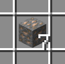
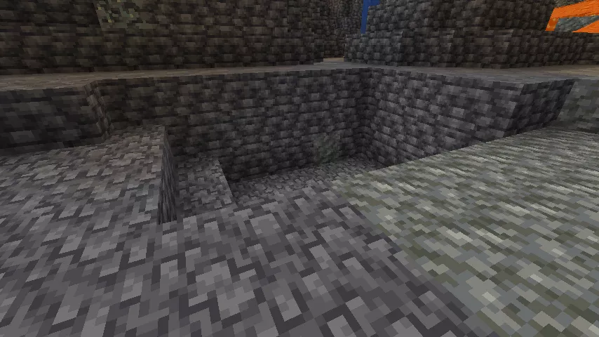
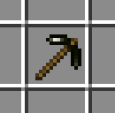
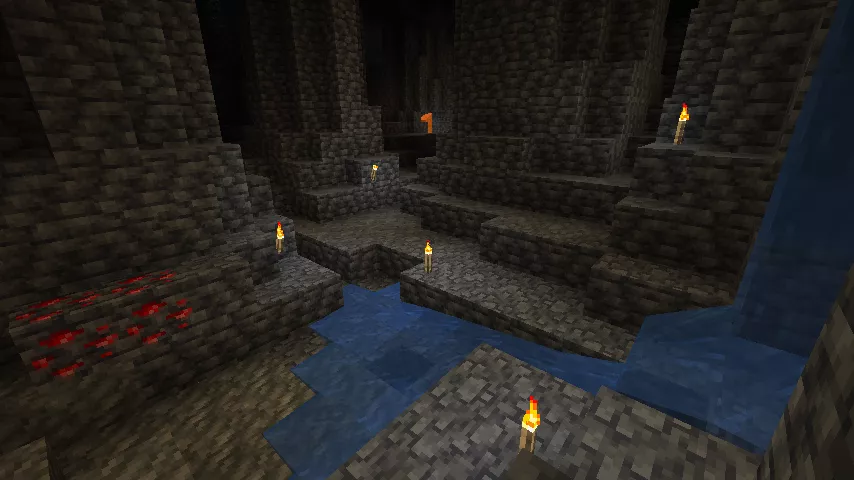
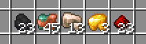
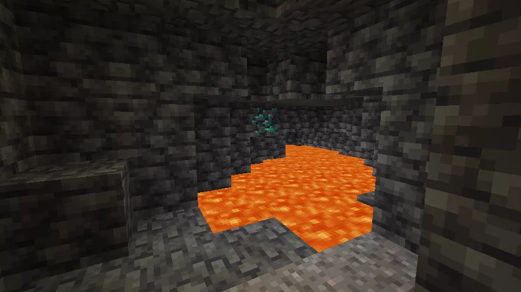

あっ……鉄鉱石が……
シャベル……ない！
……よし、這って進めば……行けるっ！



ぶはっ！！

最悪……口の中までじゃりじゃりする……



コツ コツ コツ コツ（採掘の音）
ただいまー……
つむぎ？すごい顔になってるのだ。
分かってる……
お疲れ様なのだ。
コツ コツ コツ コツ（採掘の音）
……ん？ねえ、センパイが掘ったやつ、勝手にそっちに飛んでってない？
磁鉄鉱のつるはしなのだ。

これで掘ると、掘ったものがすぐ手元に来るのだ。
えっ！？いちいち拾いに行かなくていいの！？見せて！！！！！！
え、ちょ——



えいっ！
……わっ、ほんとに来た！

遠いとこのやつも来る！！
上も下も水中のもちゃんと手元に来る！超便利じゃん！！これ！！
……もう、つむぎにあげるのだ……



コツ コツ コツ コツ（採掘の音）
ただいまー！！

――あれ？センパイそのつるはし2本目？
2本目なのだ。つむぎが取ると思ったから多めに磁鉄鉱を持って来ておいたのだ。
あはは！バレてた！
じゃああーしあっちの方掘ってくるね！
奥の方はまだ暗くて危ないのだ。
わーってるって！



センパーイ！見て！！洞窟ぐるっと回っちゃった！めっちゃサクサク取れた！

洞窟も明るくなったのだ。
ほんと、さっきまであんなに薄暗かったのに。
――あっ！センパイ！見て、あそこ！溶岩の上！！

……ダイヤモンド鉱石なのだ。
ちょっと掘ってくる！！
つむぎ、待つのだ——



磁鉄鉱なら溶岩の上でも関係ないもんね！
いっくよー！
……あれ？全然掘れない……
えいっ！えいっ！
……！？
何も出なかった！？
……ダイヤは磁鉄鉱じゃ硬すぎて歯が立たないのだ。
……そんなーーー！！！
