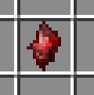
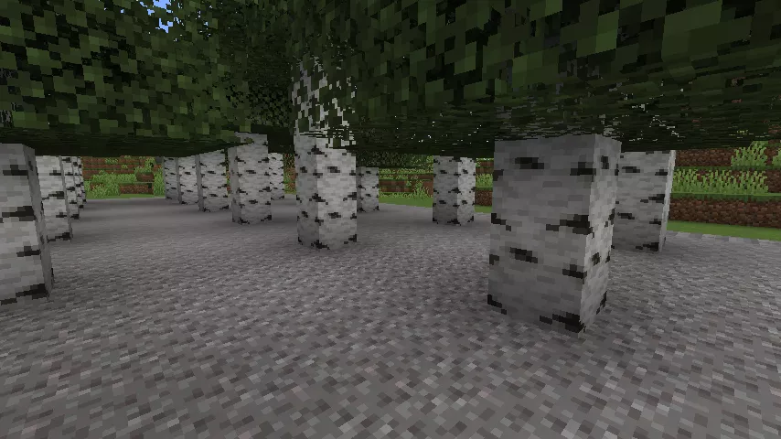
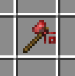
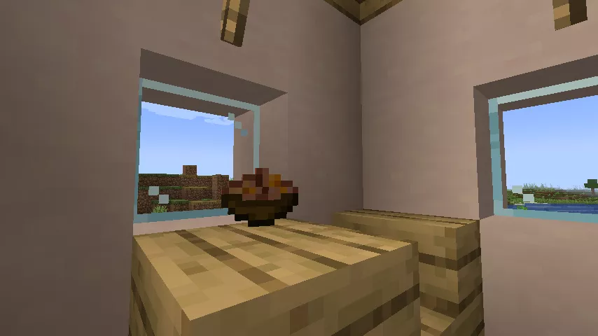
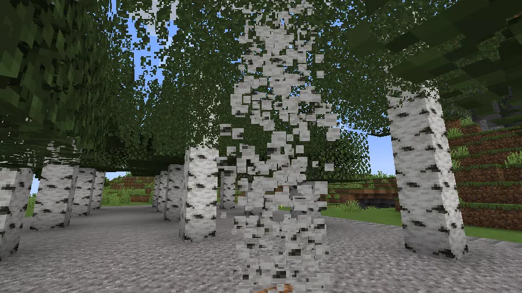
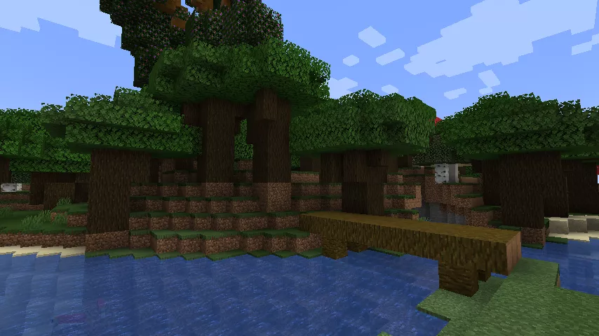
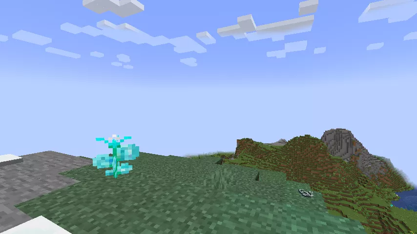
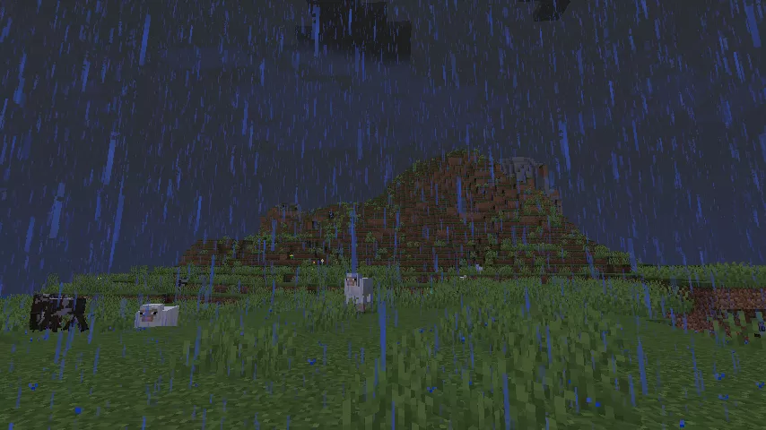
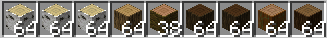

センパイ！見てこれ！なんか赤い石拾った！
ん……どこで見つけたのだ？
渓谷の下にがれきが溜まっててさ、その中に混ざってた。
紅天石なのだ。道具にすると木とか鉱石を一気に壊せるのだ。
一気に！？すごい！それってセンパイ作れる！？
つるはしか斧、片方だけなら足りるのだ。
じゃあ、これ斧にして♪



この木で試してみよーっ！
ゴッゴッゴッゴッゴッゴッ……
……？何この斧、全っ然切れないんだけど！？
ゴッゴッゴッゴッゴッゴッ……
……まっ、しょうがないか……

こんなプラスチックみたいなやつより鉄の方が強そうだし。
――つむぎ、あれから調子はどうなのだ？
なんか、これじゃ無理みたい。
要らないからセンパイあげるー……
そうか……じゃあ、ボクが使うのだ。





――今日もいっぱい食べたし、りんごでも摘んでこよっかな～
ゴッゴッゴッゴッゴッゴッゴッゴッゴッゴッゴッゴッ
……
バサッ（木が消える音）

！？センパイ、今何したの！？もしかして、さっきの……？
いかにもなのだ。根気が要る分、伐れたときの気持ちも格別なのだ。
あーしもやってみたい！また貸して！
さっき要らないって言ったのだ。
あれはなし！お願いっ！！



もう1本！はい消えた！！次！
――あっはっは！！おもしろーい！！！
……つむぎ、裏山まで更地にして一体どこまで伐るつもりなのだ……？
だって面白いんだもん！！
次、あっちの川の向こう伐って来るね！
い、いってらっしゃいなのだ。



すっごい、木！木！！木！！！
これ全部持って帰ったら、いったい松明何本分になるのかな～♪



ん～！山の空気って、おいしー♪
ポツ…… ポツ……
……やば、急いで帰らなきゃ……！



進んでも進んでも雨宿りできる木がない！！！
橋こっちだったよね！……あれ？……こっち……？橋どこ……？
確かおっきな木のそばだった、はずだけど……？？？
もー！仕方ない、丸太小屋っ！！何か材料っ！！

……あれ？あーしジャングルの木なんて伐ったっけ……？
