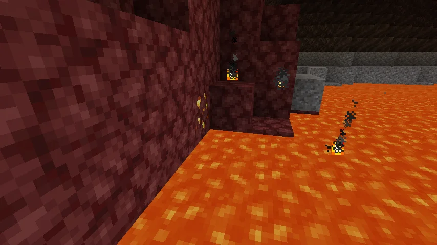
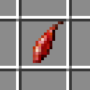
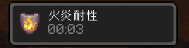
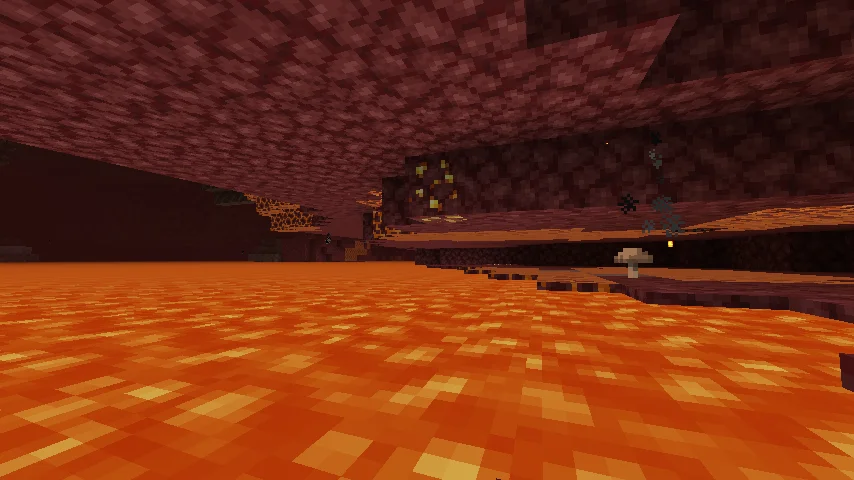
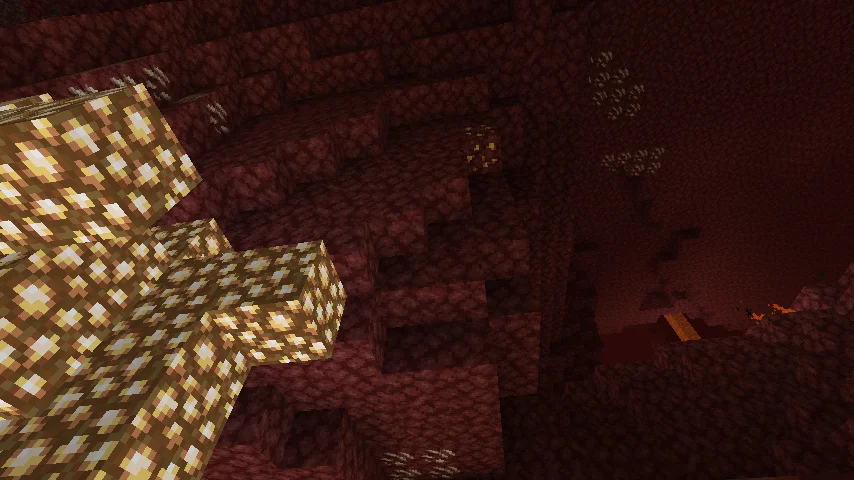
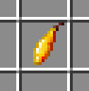
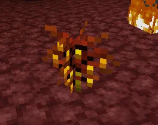
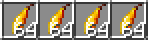
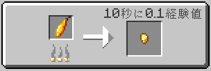

――あっつい！！！！！



……ふぅ……危うく全ロストしかけたわ
アレが取れてたら、もうちょっと生活が楽になっただろうにっ……！
つむぎー、こんなところで何してるのだ？
センパーイ……ちょっと溶岩で手怪我しちゃって……
これ、食べるといいのだ。気休め程度に火に強くなるのだ。

へー。（ぱくっ

――！！暑さが消えた！すごっ！！
今なら何でもできそうっ！！！！！！
あ、戻った。
過信は禁物なのだ。
短っ！
……じゃあ、いっぱい作ればいいんだよね！
別荘の庭全部これにしちゃおっ♪



またあった！（ぱくっ
一丁あがり！あっ、あんなところにも！

ドンッ！
あいたーっ！
つむぎー、こんなところで何してるのだ？
センパーイ……ちょっと段差で足怪我しちゃって……
これ、食べるといいのだ。気休め程度に衝撃に強くなるのだ。

何これすごっ！！金ピカで金みたいじゃん！
実際に金の抽出に使う人もいるのだ。
それ超超やばいんだけど！！あーしも植えたい！！
プロミナリアの株に金を塗りつけると、金色の実がなるようになるのだ。

ありがとう！！やってみる！！



圧巻！！！何日も待った甲斐があったーーー！！
では早速、いっただっきまーす♪

――ん～！おいしー♪力が湧いてくる…！気がする！
……？そういえばこれ、種が金で出来てるんだっけ？？
あれ？こっちも種なしだ。



つむぎー、金の抽出はできたのだ？
センパーイ……ぜんぜん金、出ないんだけど……
最後の1個、センパイにあげる……

それは妙なのだ。ボクもやってみるのだ。
ぽいっ

か、かまどで焼くのかーーーっ！！！
