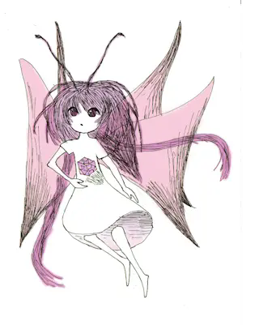

  

    

      
    

    

      <h3 class="encyclopedia-card__title">単子葉類妖花目ミラージュ科　ミラージュ</h3>
      
　蝶のような翅の生えた手のひら大の少女の姿をした妖精。非常に臆病で、滅多に人前に姿を現さない。捕まえようとしても人魂（ウィスプ）のような姿に化けて逃げ、いくら追いかけても捕まえることができないさまから、ミラージュ（蜃気楼）の名で知られている。

      
　古くは神霊の一種と考えられていたが、近年の研究により、ミラージュ植物の花粉が自律構造を持ったものであると解明された。

    

  

